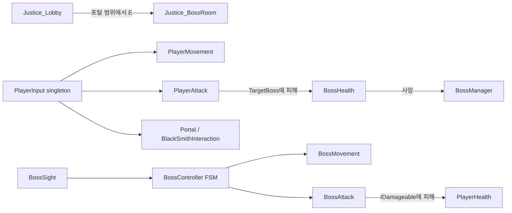

# Justice: The Last Epithet — 프로젝트 분석 문서

> 분석 기준: 2026-07-20, 저장소의 Unity 직렬화 파일과 C# 소스 정적 분석. Unity Editor 실행/플레이 모드 검증은 수행하지 않았다.

## 1. 요약

`Justice`는 Unity 6 기반의 2D 탑다운 액션 RPG 프로토타입이다. 현재 플레이 가능한 핵심 루프는 **로비에서 플레이어 조작 → 포털 상호작용 → 보스룸 이동 → 조준 기반 근접 공격과 단일 보스 AI 전투**다.

코드는 컴포넌트 분리를 시도했다. 플레이어(입력·이동·공격·체력·애니메이션), 공통 보스(탐지·이동·공격·체력·상태), 장면 관리자(카메라·보스 진행), 소품/상호작용으로 나뉜다. 다만 `HouseWarManager`와 가문 보스는 별도 실험 단계이며, 현 빌드 장면에는 연결돼 있지 않다.

| 항목 | 확인 결과 |
| --- | --- |
| Unity | `6000.4.0f1` (Unity 6) |
| 렌더링 | Universal Render Pipeline 17.4.0 |
| 입력 | Input System 1.19.0 |
| 빌드 장면 | `Justice_Lobby` → `Justice_BossRoom` |
| 데이터 | `Nexar_Data` ScriptableObject 1개 |
| 테스트 | Test Framework는 설치됐지만 테스트 소스는 없음 |

## 2. 빠른 시작과 조작

Unity Hub에서 이 폴더를 Unity `6000.4.0f1`으로 연 뒤 `Assets/Justice/Scenes/Justice_Lobby.unity`를 열어 Play 한다. 빌드에 등록된 첫 장면도 로비다.

| 행동 | 입력 |
| --- | --- |
| 이동 | WASD |
| 조준 | 마우스 위치 |
| 공격 | 마우스 왼쪽 버튼 |
| 포털/NPC 상호작용 | E |

로비 포털은 `Justice_BossRoom`을 이름으로 단일 로드한다. 플레이어 오브젝트에는 `Player` 태그와 Player 레이어가 모두 필요하다. 보스 탐지는 Player 레이어(mask bit 8)를 사용하고, 포털·NPC·카메라는 Player 태그를 사용한다.

## 3. 폴더 및 장면 구조

```text
Assets/Justice/
├─ Scenes/              Justice_Lobby, Justice_BossRoom
├─ Scripts/
│  ├─ Player/           입력·이동·공격·체력·애니메이션
│  ├─ Boss/00 Core/     공통 보스 FSM 및 ScriptableObject 데이터
│  ├─ Boss/02 Nexar/    넥사르 확장 자리(현재 비어 있음)
│  ├─ Boss/09 House/    4가문 태그 전투 실험
│  ├─ GameManager/      보스 진행, 카메라, 가문 전투 관리
│  ├─ Npc/              대장장이 UI 상호작용
│  ├─ Props/            포털, 제단, 계단, 색상 애니메이션
│  └─ Core/             IDamageable 계약
├─ Date/                Nexar_Data.asset (폴더명은 Date)
├─ Prefabs/             Player, BlackSmith, 지형 소품/식물
├─ Animations/          Player/Boss/Props Animator Controller 및 클립
├─ Images/, Models/, Sounds/
└─ ...
```

### 장면별 역할

| 장면 | 주요 오브젝트 및 역할 |
| --- | --- |
| `Justice_Lobby` | Player 프리팹, Main Camera + `CameraFollow`, 포털 + `Portal`, BlackSmith/UI, 타일맵·소품·EventSystem |
| `Justice_BossRoom` | Boss, Main Camera + `CameraFollow`, `BossManager`, 타일맵·충돌 지형·Global Volume |

`Boss`는 `Nexar_Data`를 참조하고, `BossAnimation`, `BossSight`, `BossHealth`, `BossController`, `BossAttack`, `BossMovement`, `Rigidbody2D`, Trigger `BoxCollider2D`를 포함한다.

## 4. 런타임 흐름



### 플레이어

- `PlayerInput`이 생성한 `PlayerInputActions`를 다른 컴포넌트가 공유한다.
- `PlayerMovement`는 매 프레임 입력을 읽고, `FixedUpdate`에서 `Rigidbody2D.linearVelocity`를 설정한다.
- `PlayerAnimation`은 이동 방향을 8방향(`E`, `NE`, …)으로 양자화하고 `Idle_*`/`Walk_*` 상태 이름을 직접 재생한다.
- `PlayerAttack`은 마우스 월드 좌표 방향, 보스까지 거리(기본 3), 부채꼴 각도(기본 70°), 쿨다운(0.5초)을 모두 만족하면 `BossManager.TargetBoss`에 10 피해를 준다.
- `PlayerHealth`는 200 HP로 초기화되고 사망 시 오브젝트를 비활성화한다.

### 공통 보스

`BossController`의 상태는 `Idle → Chase ↔ Attack`, `PhaseTransition`, `Death`이다. `BossSight`가 반경 7 내 Player 레이어 Collider를 찾으면 컨트롤러가 거리를 평가한다. 사거리 밖에서는 이동하고, 사거리 안에서는 쿨다운 후 애니메이션 트리거를 재생하며 대상의 `IDamageable`에 피해를 준다.

체력이 50% 이하가 되면 이동속도는 1.3배, 피해는 1.5배가 되고 1.5초 동안 전환 애니메이션 상태에 머문다. 현재 데이터 자산(`Nexar_Data`)은 HP 200, 속도 3, 사거리 2, 쿨다운 2초, 피해 10이다.

### 진행/보상

`BossManager`는 초기 방/스테이지를 1로 보유한다. 일반 보스 처치가 세 번 누적되면 보상 UI를 열고 `Time.timeScale = 0`으로 정지하도록 설계됐다. 하지만 현재 보스룸에는 보스 1마리만 있고 다음 방 생성·장면 전환 구현은 없다.

## 5. 핵심 스크립트 책임

| 영역 | 스크립트 | 책임 |
| --- | --- | --- |
| Core | `IDamageable` | HP 조회, 피해, 사망의 공통 계약 |
| Player | `PlayerInput`, `PlayerMovement`, `PlayerAttack`, `PlayerHealth`, `PlayerAnimation`, `PlayerStatus` | 입력 수명주기, 이동/공격, 생존, 8방향 표현, 가문 효과 상태 |
| Boss core | `BossData`, `BossSight`, `BossMovement`, `BossAttack`, `BossHealth`, `BossAnimation`, `BossController` | 데이터, 탐지, 물리 이동, 공격, 체력, Animator 연결, FSM 조율 |
| Managers | `BossManager`, `CameraFollow` | 현재 표적/방 진행/보상, Player 태그 대상 카메라 추적 |
| Props/NPC | `Portal`, `BlackSmithInteraction`, `PropsAltar`, `SpriteColorAnimation`, `StairsLayerTrigger` | 씬 전환, UI 토글, 시각 효과, 계단 레이어 전환 |
| 확장 초안 | `NexarController`, `NexarCurseSystem`, `HouseBossController`, `HouseWarManager` | 개별 보스 패턴 및 4가문 전투의 향후 확장 자리 |

## 6. 가문/개별 보스 확장 상태

`BossType`에는 7마왕(`Nexar` … `Delios`)과 가문 관련 타입(`Verian`, `Valten`, `Serane`, `Ordel`, `Verdan`)이 정의돼 있다. 그러나 일반 `BossAttack.ExecutePattern`의 각 타입 분기는 TODO이며 공통 근접 피해 외의 패턴이 없다. `NexarController`와 `NexarCurseSystem`은 빈 MonoBehaviour다.

`HouseWarManager`는 씬 내 `HouseBossController`를 찾아 4명 이상이면 2명 활성/2명 대기, 20초 간격 교대, 2명 처치 뒤 전원 난입·광폭화하는 규칙을 갖는다. 현 빌드 장면에는 이 관리자나 가문 보스가 없으므로 현재 게임 루프에는 작동하지 않는다.

`PlayerStatus`의 가문 효과도 연결되지 않았다. Blindness의 피해 감소 계산과 Loyalty의 스태미나 반환 계산은 존재하지만, `PlayerHealth.TakeDamage`나 스태미나 시스템이 이를 호출하지 않는다.

## 7. 확인된 리스크와 우선순위

### P0 — 플레이 안정성을 먼저 보장할 항목

1. **`BossController.Awake()`의 null 검사 순서**: `bossData.moveSpeed`를 `Start()`의 null 검사보다 먼저 읽는다. Inspector에서 데이터 참조가 빠지면 의도한 오류 로그 대신 `NullReferenceException`이 발생한다. `Awake`에서 검증하거나 초기화 읽기를 `Start`의 검사 뒤로 옮겨야 한다.
2. **씬 전환 후 싱글턴 의존성**: `PlayerInput.Instance`는 중복 방지·`DontDestroyOnLoad`가 없고, 포털은 단일 장면 로드를 사용한다. 각 씬에 PlayerInput이 반드시 있어야 하며, 실행 순서에 따라 `PlayerMovement`/`PlayerAttack`/NPC가 Awake에서 null을 받을 수 있다. 부트스트랩 장면 또는 명시적 서비스 초기화를 마련해야 한다.

### P1 — 기능 정확도/완성도

1. **데이터와 로직 불일치**: `BossData.phase2Threshold`가 있으나 `BossHealth`는 항상 50%를 사용한다. 데이터 값을 체력 컴포넌트에 전달해 사용해야 한다.
2. **2페이즈 피해값 미반영**: `BossController`는 `currentDamage`를 1.5배로 바꾸지만 `BossAttack.Initialize`을 다시 호출하지 않는다. 따라서 공격 컴포넌트의 실제 `damage`는 기존 값에 남는다.
3. **가문 보스 이중 초기화 가능성**: `BossController.Start()`와 `HouseBossController.InitializeBoss()` 모두 `BossHealth.Initialize()`을 호출한다. 가문 모드에서 BossManager 표적 등록과 체력 상태가 중복 초기화될 수 있다.
4. **보스 사망 연출 순서**: 일반 보스는 `Destroy(gameObject, 1.5f)`를 예약하지만 Collider/AI는 즉시 비활성화하지 않는다. 사망 애니메이션 중 재피해·추적이 일어날 가능성이 있다.
5. **진행 루프 미연결**: 방 수는 증가하지만 다음 보스/방을 생성하지 않으며, 보상 UI 참조도 보스룸 직렬화에서 연결 여부를 플레이 모드로 확인해야 한다.

### P2 — 유지보수 및 품질

1. **README 및 소스 주석/로그 인코딩 손상**: 기존 `README.md`와 다수의 한글 문자열이 깨져 있어 협업·디버깅이 어렵다. 파일을 UTF-8로 통일해야 한다.
2. **이름/네임스페이스 정리 필요**: `Assets/Justice/Date`는 `Data`의 오타로 보이며, 기존 직렬화 `m_EditorClassIdentifier`에는 `Boss.*`가 남아 있지만 현재 소스는 `Core` 네임스페이스다. GUID로 로드되더라도 리팩터링 전 백업과 Unity 재직렬화를 권장한다.
3. **입력 맵을 여러 컴포넌트가 Enable/Disable**: Player, 이동, 공격, NPC 모두 같은 액션 맵을 켜고 끈다. 한 컴포넌트가 꺼질 때 전체 입력이 꺼질 수 있으므로 `PlayerInput`만 수명주기를 소유하는 편이 안전하다.
4. **정적 검증 공백**: 자동 테스트, CI, 코드 스타일/분석 설정이 없다. 최소한 입력·피해·2페이즈·장면 전환에 대한 PlayMode 테스트가 필요하다.

## 8. 권장 구현 순서

1. 씬 공통 부트스트랩(`PlayerInput`, 필요 시 `PlayerStatus`)과 Player 생성/유지 정책을 정하고, 두 장면 전환을 Play Mode로 검증한다.
2. 보스 초기화 API를 한 곳으로 통합한다. `BossData` null 안전성, 2페이즈 임계값, 강화된 공격 피해, 사망 시 충돌/AI 비활성화를 함께 수정한다.
3. `BossManager`에 방/보스 스폰 또는 명시적 다음 장면 전환을 연결하고 보상 UI를 실제 데이터와 연결한다.
4. 공통 공격 이후 개별 패턴 인터페이스를 도입해 Nexar부터 1종을 완성한다. 빈 컨트롤러와 `switch` TODO를 기능 구현 또는 제거 중 하나로 정리한다.
5. 가문 전투는 별도 테스트 장면에서 완성한 뒤 메인 진행에 결합한다. `PlayerStatus` 효과도 피해/스태미나 시스템에 실제 연결한다.
6. 기존 README를 정상 UTF-8 한국어로 교체하고, 이 문서를 개발 기준 문서로 유지한다.

## 9. 검증 체크리스트

- [ ] 로비 시작 시 PlayerInput, Player, 카메라가 정상 연결된다.
- [ ] 포털에서 E를 눌러 보스룸으로 이동한 뒤에도 이동/조준/공격이 동작한다.
- [ ] Player 태그와 Player 레이어가 모두 지정돼 보스 탐지와 상호작용이 동작한다.
- [ ] 보스가 탐지·추적·사거리 공격·피해·사망 애니메이션을 순서대로 수행한다.
- [ ] 2페이즈 진입 시 데이터상의 임계값, 속도, 실제 공격 피해가 모두 반영된다.
- [ ] 보스 처치 뒤 TargetBoss가 해제되고 플레이어가 더는 사망 보스를 공격하지 않는다.
- [ ] 보상 UI, 시간 정지/재개, 다음 방 진행이 의도대로 이어진다.
- [ ] 가문 전투는 전용 씬에서 4명 배치·교대·2페이즈·사망 처리까지 검증한다.

