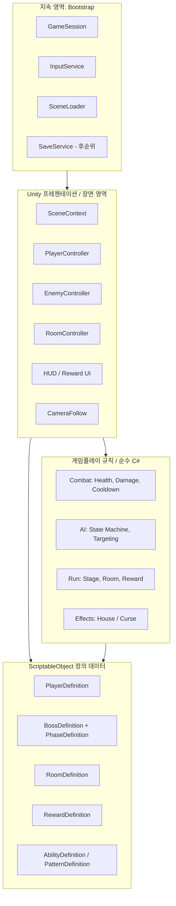
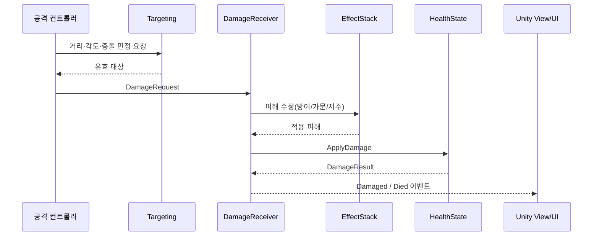

# Justice: The Last Epithet — 목표 아키텍처

> 기준 문서: [현재 구조 분석](PROJECT_ANALYSIS_KO.md)  
> 목적: 현재 프로토타입을 **여러 보스·방·가문 효과를 안정적으로 확장할 수 있는 싱글플레이 Unity 2D 게임 구조**로 전환한다. 이 문서는 구현 명세가 아니라 의존성 방향과 책임 경계를 정하는 설계 기준이다.

## 1. 설계 목표와 비목표

### 목표

1. **장면 전환에 안전한 게임 루프**: 입력, 플레이어 상태, 진행 상태를 예측 가능하게 초기화한다.
2. **데이터 중심 전투**: 보스·플레이어·방·보상 수치를 ScriptableObject 데이터로 표현하고, 로직은 데이터 타입에 의존하지 않는다.
3. **조합 가능한 보스 패턴**: `switch (BossType)` 없이 공통 전투와 개별 패턴을 조합한다.
4. **명확한 소유권**: 누가 입력을 켜고, 누가 피해를 적용하며, 누가 장면/방 진행을 바꾸는지 한 곳에서 결정한다.
5. **테스트 가능한 핵심 규칙**: 피해 계산, 페이즈 전환, 룸 진행, 보상 선택은 Unity 오브젝트 없이도 검증 가능하게 만든다.

### 비목표

- 범용 ECS 전환, 멀티플레이, 네트워크 동기화는 현재 범위가 아니다.
- 모든 Unity API를 추상화하지 않는다. 물리·Animator·SceneManager는 프레젠테이션/인프라 계층에 남긴다.
- 초기에 대형 서비스 로케이터나 전역 이벤트 버스를 만들지 않는다. 필요한 기능 경계에서만 명시적 참조와 타입 있는 이벤트를 사용한다.

## 2. 핵심 원칙

| 원칙 | 적용 방식 |
| --- | --- |
| 단일 책임 | 이동, 체력, 공격 판정, 애니메이션, 룸 진행은 서로 다른 컴포넌트/서비스가 소유한다. |
| 의존성 역전 | 순수 규칙은 UnityEngine에 의존하지 않고, MonoBehaviour가 규칙을 호출해 화면·물리를 연결한다. |
| 데이터와 상태 분리 | ScriptableObject는 변경 불가한 정의값, 런타임 상태는 인스턴스/세션 객체에 보관한다. |
| 명시적 수명주기 | 부트스트랩은 지속하고, 장면 내용은 장면과 함께 생명주기를 마친다. |
| 이벤트는 결과 통지 | `Damaged`, `Died`, `RoomCleared`는 결과를 알릴 때 사용한다. 핵심 명령은 호출자와 책임자가 명확한 메서드로 전달한다. |

## 3. 목표 구조 개요



의존성은 바깥(Unity 장면)에서 안쪽(규칙)으로만 향한다. `Gameplay`는 `MonoBehaviour`, `GameObject`, `Time`, `Physics2D`, `SceneManager`를 참조하지 않는다. Unity 측 코드는 입력·물리·애니메이션·UI를 담당하고 순수 규칙의 결과를 반영한다.

## 4. 계층과 책임

### 4.1 Bootstrap — 게임 전체 수명주기

첫 장면은 `Bootstrap` 하나로 두고, 다음 항목만 `DontDestroyOnLoad`한다.

| 구성 | 책임 | 금지 사항 |
| --- | --- | --- |
| `GameBootstrapper` | 서비스 생성 순서, 첫 게임 장면 로드 | 전투 규칙 보유 |
| `GameSession` | 현재 Run(스테이지, 방, 획득 보상, 플레이어 런타임 상태) 보유 | Scene의 GameObject 직접 검색 |
| `InputService` | Input System action map 생성·Enable/Disable의 유일한 소유자 | 개별 NPC/공격 컴포넌트가 action map 제어 |
| `SceneLoader` | 로딩 요청을 직렬화하고 SceneContext 준비 완료를 대기 | Portal이 `SceneManager.LoadScene`을 직접 호출 |

`PlayerInput`을 여러 씬에 배치하는 방식은 폐기한다. `InputService`가 `PlayerInputActions` 단 하나를 보유하고, `PlayerInputReader`가 이동/조준/상호작용/공격 값을 읽어 장면의 플레이어 컨트롤러에 제공한다.

### 4.2 SceneContext — 장면 조립 지점

각 게임 장면에는 정확히 하나의 `SceneContext`가 있다. Inspector로 `PlayerSpawnPoint`, `RoomController`, `CameraFollow`, HUD, NPC/UI 루트 같은 장면 참조를 받고, 로드 후 `GameSession`과 연결한다.

```text
Bootstrap
  └─ SceneLoader.Load(GameplayScene)
       └─ SceneContext.Initialize(session, inputService)
            ├─ PlayerFactory.SpawnOrRebind(...)
            ├─ RoomController.Initialize(...)
            ├─ CameraFollow.SetTarget(player.Transform)
            └─ HUD.Bind(player.Health, room.Progress)
```

씬 내부 오브젝트를 `FindGameObjectWithTag`, 정적 싱글턴 또는 실행 순서에 의존해 발견하지 않는다. 태그/레이어는 충돌 및 물리 필터링에만 쓰고, 서비스 획득에는 쓰지 않는다.

### 4.3 Gameplay — 순수 규칙

다음은 가능한 한 Unity 독립 C# 클래스/struct로 둔다.

| 모듈 | 예시 객체 | 책임 |
| --- | --- | --- |
| Combat | `HealthState`, `DamageRequest`, `DamageResolver`, `Cooldown` | 피해 유효성, 방어/효과 수정, 사망, 재사용 대기시간 |
| AI | `EnemyBrain`, `EnemyState`, `TargetSnapshot` | Idle/Chase/Attack/Phase/Dead 상태와 전이 판단 |
| Run | `RunState`, `RoomProgression`, `RewardSelector` | 방 완료, 다음 방/스테이지, 보상 적용 |
| Effects | `EffectStack`, `HouseEffect`, `CurseEffect` | 가문/저주 효과의 조건과 수치 수정 |

Unity 컴포넌트는 이 객체에 시간·거리·감지 결과 같은 입력값을 전달하고, 결과 명령을 실행한다. 예를 들어 `EnemyBrain.Tick(snapshot, deltaTime)`은 `MoveTo`, `UseAbility`, `Stop`, `EnterPhase` 같은 의도를 반환하고, `EnemyController`가 Rigidbody2D와 Animator로 이를 실현한다.

## 5. 데이터 모델

### 5.1 정적 정의와 런타임 상태

| 구분 | 저장 위치 | 예 | 변경 규칙 |
| --- | --- | --- | --- |
| 정의(Definition) | ScriptableObject | 최대 HP, 이동 속도, 패턴 목록, 방 편성, 보상 후보 | 에디터에서만 변경 |
| 런타임 상태(State) | 일반 C# 객체 | 현재 HP, 남은 쿨다운, 현재 페이즈, 사망 여부 | 플레이 중에만 변경 |
| 저장 데이터(Save DTO) | 직렬화 가능한 DTO | 해금, 설정, 영구 진행도 | 게임 종료 후에도 유지 |

기존 `BossData`는 `BossDefinition`으로 확장한다. 특히 `phase2Threshold`는 정의에만 두고, `HealthState`와 `EnemyBrain`이 이를 사용해 전환한다. 정의 자산 자체에 현재 HP나 쿨다운을 기록하지 않는다.

### 5.2 권장 Definition 구성

```text
BossDefinition
├─ id, displayName, prefab
├─ baseStats: CharacterStatsDefinition
├─ phases: List<PhaseDefinition>
└─ rewards: List<RewardDefinition>

PhaseDefinition
├─ healthThreshold (예: 1.0, 0.5)
├─ statModifiers (speed, damage 등)
├─ abilities: List<AbilityDefinition>
└─ transitionDuration / animationTrigger

RoomDefinition
├─ id, arenaScene 또는 arenaPrefab
├─ encounter: EncounterDefinition
└─ completionRule

EncounterDefinition
├─ spawnEntries: List<EnemySpawnEntry>
└─ mode: SingleBoss | HouseBattle
```

`BossType` enum은 Inspector 선택이 편한 동안 유지할 수 있으나, 콘텐츠가 늘면 문자열/Serializable ID로 이전한다. 런타임 분기는 타입 enum이 아니라 `AbilityDefinition` 목록과 `IAbilityExecutor` 조합으로 처리한다.

## 6. 전투 아키텍처

### 6.1 공통 계약

```csharp
public interface IDamageReceiver
{
    DamageResult ReceiveDamage(in DamageRequest request);
}

public readonly record struct DamageRequest(
    float Amount,
    DamageType Type,
    object Source);

public readonly record struct DamageResult(
    float AppliedAmount,
    bool WasBlocked,
    bool Died);
```

`PlayerAttack`이 `BossManager.TargetBoss`를 직접 참조하는 구조를 없앤다. 공격자는 `ITargetingService` 또는 물리 감지 결과로 목표를 얻고, 목표의 `IDamageReceiver`에 `DamageRequest`를 보낸다. 보스가 하나일 때도 동일한 흐름을 유지하므로 다수 적·소환물·가문 보스로 확장할 수 있다.

### 6.2 피해 처리 순서



`PlayerStatus.CalculateMitigatedDamage`처럼 독립된 효과는 `EffectStack`의 modifier로 옮긴다. 이로써 Blindness/Obedience/Order/Loyalty, 버프, 디버프, 보스 저주가 같은 파이프라인에서 작동한다.

### 6.3 보스 AI와 패턴

공통 AI는 상태만 결정하고, 실제 패턴은 능력 객체가 수행한다.

```text
EnemyController (MonoBehaviour)
├─ EnemyBrain                 # 상태 전이와 능력 선택
├─ HealthPresenter            # HealthState ↔ Animator/UI
├─ EnemyMotor                 # Rigidbody2D 이동
├─ EnemyTargetSensor          # Physics2D 감지
└─ AbilityRunner              # AbilityDefinition 실행, 쿨다운
     ├─ MeleeAbility
     ├─ ProjectileAbility
     ├─ AreaCurseAbility
     └─ SummonAbility
```

`NexarCurseSystem`은 `AreaCurseAbility` 또는 Nexar 전용 `IAbilityExecutor`가 된다. 구현되지 않은 보스는 기본 `MeleeAbility`만 가진 `BossDefinition`으로도 동작한다. 따라서 새 보스는 대체로 **데이터 자산 생성 + 프리팹 구성 + 필요한 능력 executor 추가**만으로 들어온다.

## 7. 룸·스테이지·가문 전투

### 7.1 일반 진행

`BossManager`는 `RunCoordinator`로 대체한다. `RunCoordinator`는 `RunState`를 소유하고, `RoomController`는 장면의 적 스폰·퇴장·완료 감지만 소유한다.

```text
Portal/NPC → SceneLoader 요청
SceneContext → RoomController.Start(RoomDefinition)
RoomController → EncounterSpawner.Spawn(EncounterDefinition)
모든 완료 조건 충족 → RoomController.RoomCleared
RunCoordinator → RunState.Advance / RewardSelector.Open
Reward UI → RunCoordinator.ApplyReward
```

보상 UI가 `Time.timeScale`을 직접 변경하지 않는다. `GamePauseService`가 `Gameplay`, `UI`, `Cutscene` 같은 pause reason을 참조 카운트로 관리한다. 룸 전환 중에는 입력/전투를 명시적으로 잠그고 로딩이 완료된 뒤 해제한다.

### 7.2 가문 전투

`HouseWarManager`의 전술 규칙은 `HouseBattleDirector`(순수 규칙)와 `HouseBattleController`(장면 실행)로 분리한다.

- Director: 활성/대기 명단, 교대 시간, 사망 수, Phase 2 전환을 계산한다.
- Controller: Director의 `TagOut`, `TagIn`, `BerserkAll` 명령에 따라 오브젝트 위치·렌더러·AI를 변경한다.
- 각 가문 특성은 `HouseEffectDefinition`으로 표현하고, Player와 Boss 모두의 `EffectStack`에 적용한다.

일반 단일 보스와 가문 전투는 둘 다 `EncounterDefinition`과 `RoomController` 아래에서 시작하되, 서로 다른 `IEncounterDirector` 구현을 사용한다.

## 8. 권장 폴더 및 Assembly Definition

```text
Assets/Justice/
├─ Runtime/
│  ├─ Bootstrap/              Justice.Bootstrap.asmdef
│  ├─ Gameplay/
│  │  ├─ Combat/              Justice.Gameplay.asmdef
│  │  ├─ AI/
│  │  ├─ Run/
│  │  └─ Effects/
│  ├─ Presentation/
│  │  ├─ Player/              Justice.Presentation.asmdef
│  │  ├─ Enemy/
│  │  ├─ Rooms/
│  │  ├─ UI/
│  │  └─ World/
│  └─ Shared/                 Justice.Shared.asmdef
├─ Data/
│  ├─ Definitions/
│  └─ RuntimeAssets/
├─ Prefabs/
├─ Scenes/
│  ├─ Bootstrap.unity
│  ├─ Lobby.unity
│  ├─ Arena_*.unity
│  └─ Test_*.unity
└─ Tests/
   ├─ EditMode/               Justice.Gameplay.Tests.asmdef
   └─ PlayMode/               Justice.Presentation.Tests.asmdef
```

권장 의존성은 `Presentation → Gameplay → Shared`, `Bootstrap → Presentation/Gameplay`, `Tests → 대상 모듈`이다. `Gameplay` asmdef는 UnityEngine 참조를 끈다. 초기에는 기존 `Scripts`를 한 번에 이동하지 말고, 새 기능부터 이 구조로 추가한 뒤 모듈별로 이관한다.

## 9. 현재 코드의 목표 구조 매핑

| 현재 | 목표 | 전환 방식 |
| --- | --- | --- |
| `PlayerInput` | `InputService` + `PlayerInputReader` | action map 수명주기를 서비스 단일 소유로 이관 |
| `PlayerMovement` | `PlayerController` + `CharacterMotor` | 입력 읽기와 Rigidbody2D 이동을 분리 |
| `PlayerAttack` | `MeleeAttackController` + Targeting + Combat | `BossManager.TargetBoss` 의존 제거 |
| `PlayerHealth`, `BossHealth` | 공통 `HealthState` + `HealthPresenter` | 한 피해 파이프라인으로 통합 |
| `PlayerStatus` | `EffectStack` + `HouseEffectDefinition` | 계산 메서드를 modifier로 이관 |
| `BossData` | `BossDefinition` + `PhaseDefinition` | 페이즈/능력/보상 데이터 확장 |
| `BossController` | `EnemyController` + `EnemyBrain` + `AbilityRunner` | 상태 판단과 Unity 실행 분리 |
| `BossAttack`의 switch | `AbilityDefinition` + executor | 보스 타입 분기 제거 |
| `BossManager` | `RunCoordinator` + `RoomController` | 진행 상태와 장면 스폰 분리 |
| `HouseWarManager` | `HouseBattleDirector` + `IEncounterDirector` | 가문 전술을 일반 룸 체계에 통합 |
| `Portal` | `SceneTransitionTrigger` | SceneLoader에 전환 의도를 전달 |
| `CameraFollow` | `CameraFollow.SetTarget()` | 태그 검색 대신 SceneContext가 주입 |

## 10. 단계별 이행 계획

### 단계 0 — 안전망 (먼저 완료)

- README/로그/코드 파일을 UTF-8로 정리한다.
- `Bootstrap` 장면과 `GameBootstrapper`, `InputService`, `SceneContext`를 도입한다.
- 모든 씬에서 Player 입력·카메라 바인딩이 안정적으로 동작하는 PlayMode 테스트를 만든다.
- 기존 구조의 보스 데이터 null 검사, 2페이즈 피해 갱신, 사망 시 충돌/AI 중지를 수정한다.

### 단계 1 — 전투 공통화

- `HealthState`/`DamageRequest`/`DamageResult` 및 공통 `IDamageReceiver`를 도입한다.
- 플레이어 근접 공격과 보스 근접 공격을 새 피해 경로로 이관한다.
- `BossData.phase2Threshold`를 실제 전환에 연결하고 공격 쿨다운·피해가 페이즈별 데이터를 따르게 한다.

### 단계 2 — 진행과 룸

- `RunState`, `RoomDefinition`, `RoomController`, `RunCoordinator`를 구현한다.
- 한 보스룸을 `RoomDefinition` 하나로 이관한 뒤, 다음 룸 전환과 보상 선택을 연결한다.
- UI는 상태를 관찰만 하고 진행 상태를 직접 바꾸지 않게 한다.

### 단계 3 — 콘텐츠 확장

- `AbilityDefinition`/`AbilityRunner`와 Nexar의 저주 능력 1종을 구현한다.
- 가문 특성을 `EffectStack`에 연결한다.
- House Battle을 별도 테스트 장면에서 `IEncounterDirector`로 이관한다.

### 단계 4 — 품질 체계

- Combat/Run은 EditMode 단위 테스트, 씬 조립·입력·전환은 PlayMode 테스트로 분리한다.
- asmdef를 적용해 순환 의존을 막고 컴파일 범위를 줄인다.
- 콘텐츠 ID, 저장 DTO, 밸런스 테이블을 정리한 뒤 저장/해금 기능을 추가한다.

## 11. 완료 기준

목표 아키텍처는 다음을 모두 만족하면 1차 도입 완료로 본다.

- [ ] 모든 게임 장면이 `SceneContext`로 초기화되며 PlayerInput 싱글턴/태그 검색에 의존하지 않는다.
- [ ] 전투 피해가 `DamageRequest → EffectStack → HealthState` 경로 하나로 적용된다.
- [ ] 새 보스를 `BossType switch` 수정 없이 Definition과 Ability 조합으로 추가할 수 있다.
- [ ] 룸 완료·보상·다음 룸 진행은 `RunCoordinator`만 변경한다.
- [ ] 단일 보스와 가문 전투가 같은 `EncounterDefinition` 진입점에서 동작한다.
- [ ] 핵심 전투/진행 규칙에 EditMode 테스트가 있고, 로비→전투룸 전환에 PlayMode 테스트가 있다.

